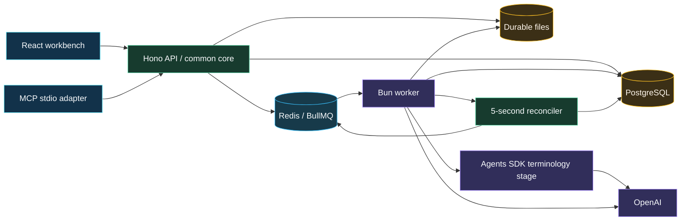

# Stark document translator

Private repository: [dmitryostrov/stark-document-translator](https://github.com/dmitryostrov/stark-document-translator).

A local workbench for support staff and dealers translating non-sensitive technical prose. It accepts searchable PDF and UTF-8 Markdown, prepares a cost quote locally, and calls OpenAI only after explicit approval. PDF output is a readable Unicode reflow; Markdown preserves its document structure, code and link targets.

Branding provisionally follows the user's [Stark Future](https://starkfuture.com/) candidate and its [team page](https://starkfuture.com/team). The dark/gold wordmark is a local interpretation, not a claim of official brand colors or employer affiliation.

## Run

Requirements: Docker with Compose v2 (supporting `!reset`) and an OpenAI key file. Host Bun, Python, Poppler and PostgreSQL are unnecessary for running the application.

Clone with an account that has access:

```sh
git clone git@github.com:dmitryostrov/stark-document-translator.git
cd stark-document-translator
```

1. Create a private plaintext key file outside the checkout.
2. Copy `.env.example` to `.env` and set `OPENAI_KEY_PATH` to that file's absolute path. Use forward slashes on Windows. The existing assessment key path works locally; it is excluded from Git and the image.
3. Run:

```sh
docker compose up --build
```

Open [the workbench](http://127.0.0.1:3100). Choose a document/language, **Prepare and estimate**, then approve the displayed quote and cost cap. Targets are English, German and French. Quality evidence is currently limited to the synthetic English-to-German corpus; other pairs display an insufficient-evidence warning.

Only the worker mounts the key as a read-only Docker secret. PostgreSQL, Redis, source/checkpoint/artifact files and the generated editor credential use named volumes. The API generates the credential automatically; do not run a host setup script. Services listen through a loopback HTTP port. This is a local assessment deployment; shared/public production deployment requires real user authentication and TLS.

Stopping/recreating containers preserves named volumes. Do not remove volumes to “repair” a job. No automatic cleanup deletes source or artifact versions.

## Architecture and recovery



Cyan is a front door, green is control, amber is durable data, blue is broker delivery and purple is execution.

PostgreSQL owns job state, approval, fair admission, call accounting and artifact identity. BullMQ carries disposable notifications, not authoritative work. Accepted uploads stream to a flushed file, are renamed and directory-flushed before the job commit/202 response. Commit then best-effort enqueue; the reconciler repairs missed notifications. There is no outbox or dispatcher lease.

Each unit has a generation and a 30-second database lease, renewed every 10 seconds. Broker locks last 60 seconds, renew every 20 seconds, and are checked for stalls every 10 seconds. Finished broker jobs are removed. Retained terminal IDs and active notifications without a domain claim get a new fenced generation; live-lease duplicates do no work. Persisted `not_before` controls safe rate-limit retries even after broker loss.

Global model admission is four units, at most two per document/group, ordered by least recent admission. A model-call identity stays stable across generations. Every direct call and agent turn reserves budget before transport. Completed responses/usage are checkpoints. A crash or timeout after submission becomes **NEEDS_ATTENTION / OUTCOME_UNKNOWN**, with possible charge displayed; it is never automatically resubmitted. This makes uncertainty visible rather than promising exactly-once execution from an external API without reconciliation support.

Explicit non-executing 429 responses allow three total attempts with persisted backoff. Provider 500/timeouts are uncertain. Invalid paid output retains its known cost and publishes no artifact. Artifacts are immutable, flushed/checksummed files; a manifest lets restart reuse a complete render. Publication commits artifact and render state together. Cancellation fences work; a call already submitted may still complete and incur cost.

## Where the agent earns its place

The official TypeScript [`@openai/agents`](https://developers.openai.com/api/docs/guides/agents/sdk) stage retrieves definitions and visible occurrences through `find_source_context`, `read_source_blocks`, and `lookup_glossary`, then creates a bounded evidence-linked glossary. Ambiguous terms can depend on a definition far beyond the current chunk. Ordinary translation uses structured completions and deterministic checks; it does not need an agent deciding how to schedule or bill.

The SDK model adapter checkpoints and prices **each** turn. Automatic SDK/client retries, tracing, remote tool access and streaming are disabled. Source/tool text is treated as untrusted data. Tool reads are limited to accepted visible block IDs. Source context is bounded, the agent has four turns, and outputs are limited.

The assessment names the Python package `openai-agents`; the explicit user no-Python requirement selects the official TypeScript SDK instead. Evaluator acceptance of that substitution remains separate from SDK integration evidence.

## Product acceptance

Exactly three criteria govern this delivery:

1. **AC1 — Translation and fidelity:** PDF→PDF and Markdown→Markdown through both web and MCP, English→German; ≥95% approved terminology occurrences across ≥40 held-out references, 100% protected numeric occurrence preservation, complete accepted-visible coverage and no added output destinations. Automated candidate terminology measurement is 256/261 (98.1%), numeric preservation 161/161. Human reference/semantic review is pending; [40 examples](evidence/quality-review.md) are prepared.
2. **AC2 — Recoverability:** forced process/container deaths resume safely eligible work or produce actionable uncertainty within 60 seconds after healthy dependencies, without repeating completed/uncertain calls or publishing partial artifacts. See the [ten-case SIGKILL evidence](evidence/chaos.json) and [queue/provider regressions](evidence/regressions.json).
3. **AC3 — Isolation and bounded work:** two small owners plus a 200-page document, small paid admission within five seconds in deterministic fixtures, owner denial, and named corrupt/scanned/over-limit errors before model calls. See [fairness and rerender evidence](evidence/fairness.json). A separate [folder fairness regression](evidence/folder-fairness.json) admitted another owner in 172 ms while a folder held its two paid slots.

The current 20-sample real cold corpus has mean known cost **$0.0013247**, p50 **7.499 s**, p95 **13.952 s**. These small/medium synthetic documents are not a forecast for 200-page manuals. Quotes show the matching observed range/time window when available, otherwise a conservative reservation bound and unavailable time estimate. A separate identical-request prefix probe observed 1,536 cached tokens on each of three repeats, saving $0.0004608 input cost per repeat. The complete methods, first-run failures and limits are in [DECISIONS.md](DECISIONS.md).

## PDF, Markdown and content policy

Limits: 25 MiB, 250 PDF pages, 300,000 extracted words, 120-minute job deadline; quotes expire after 15 minutes. Large text is split by Unicode codepoint under a token bound, with stable block IDs and previous-chunk context. Exact repeated margin text has canonical translations and ordered occurrence aliases. Ordinary body repetition is preserved.

PDF.js operator/text alignment and local Poppler inspection accept a conservative prose profile. Proven invisible/white/off-page text is excluded with warnings. Tiny/low-contrast, clipping/painted backgrounds, unsupported rendering modes, annotations or unresolved visibility reject locally. Scans require OCR and are rejected. Images with visible text require an explicit text-only acknowledgment and a new preparation key. Source JavaScript, attachments and actions are never copied into the newly created PDF. Glyph-remapping attacks need the deferred render/OCR comparison; this is not a complete PDF security detector.

Markdown uses an AST, preserves code and destination values, rejects raw HTML and unsafe URI schemes, and checks UTF-8. Neither front door renders or fetches source HTML/images. Downloads use attachment/nosniff headers. Local screening rejects VS-NfD, NATO RESTRICTED, ITAR labels and unsupported concealment controls. Absence of those markers does not establish clearance.

Validation protects ordered IDs, count/coverage, numeric/code/unit/URL/email multiplicity, length, language samples and unwanted refusal/chatty output. Paid validation failures retain the response/cost checkpoint; they are not silently paid for again. [Live attack fixtures](evidence/live-scenarios.json) are a bounded measurement, not a general injection guarantee.

## API and costs

Cookie-scoped browser sessions and a separate private bearer-scoped editor owner share one core. Another owner receives 404 for a job. Neither owner IDs nor error bodies expose document text.

| Operation                            | Contract                                                                                                                         |
| ------------------------------------ | -------------------------------------------------------------------------------------------------------------------------------- |
| `POST /api/translations`             | Multipart `file`, `target_language`, optional `acknowledge_text_only_pdf`; `Idempotency-Key`; returns 202 persisted job metadata |
| `GET /api/translations/:id`          | Stage, progress, warnings/error, quote, cost, quality and artifact metadata                                                      |
| `POST /api/translations/:id/start`   | JSON `quote_version`, `max_cost_usd`; a distinct start key; explicit approval before paid work                                   |
| `POST /api/translations/:id/cancel`  | Fences outstanding work                                                                                                          |
| `GET /api/translations/:id/artifact` | Complete checksummed attachment only                                                                                             |
| `GET /api/translations/:id/receipt`  | Downloadable usage/model/policy/rates/glossary-hash/tool-count receipt                                                           |
| `POST /api/translation-groups`       | Fixed Markdown manifest, at most 20 files/25 MiB; separate group quote/start and aggregate cap                                   |

Preparation/retry with the same owner/key/content returns one job; changed content/target/options returns 409. A start key binds quote and cap. Stale/expired approvals are rejected. Job and group caps include completed costs, active reservations and unknown exposure atomically. The supported model is `gpt-4.1-mini`; changing model requires explicitly configured rates and new calibration.

The initial response and every status include cost. Before calls, known cost is zero. A typical shape is:

```json
{
  "currency": "USD",
  "known_cost_usd": 0.0013247,
  "active_reserved_usd": 0,
  "unresolved_exposure_usd": 0,
  "completed_calls": 3,
  "tokens": {"input": 1653, "output": 415, "cached": 0, "cache_write": 0},
  "cap_usd": 0.25
}
```

This is token-based accounting at versioned model rates, not a reconciled provider invoice. Unknown exposure is an upper reservation, not a confirmed bill. Agent turns count too. Local translation memory is owner/model/prompt/policy/glossary/context scoped. Provider prefix-cache read/write counters use actual usage; no caching benefit is assumed.

## MCP configuration and three-step verification

The stdio adapter uses Docker and the API's private editor credential volume; it never reads the OpenAI key. Replace the two absolute paths below with this checkout and your document workspace. Create `C:/Documents/translation-workspace/out` first. Use `.mcp.json` in a clean Claude Code workspace (or its MCP settings). No Cursor validation is performed.

```json
{
  "mcpServers": {
    "stark-translator": {
      "command": "docker",
      "args": [
        "compose",
        "--project-directory", "C:/Users/dmitr/Documents/src/stark",
        "-f", "C:/Users/dmitr/Documents/src/stark/compose.yaml",
        "run", "--rm", "--no-deps", "-T",
        "-v", "C:/Documents/translation-workspace:/workspace",
        "mcp"
      ]
    }
  }
}
```

On Linux, the mounted `out` directory must be writable by the image's `bun` account (UID 1000). Saved files are private to that account (mode 0600); arrange host ownership/access for your workspace. Automated checks change ownership only for their disposable fixture output folders and return those folders/files to the invoking host user afterward.

Keep the normal stack running first. `translate_document` and `translate_folder` each have explicit `prepare`/`start` actions. `translation_status` returns metadata, while `save_translation` verifies the download and atomically creates a file under workspace/out, refusing overwrite and traversal.

1. List tools and call `translate_document` with `action:"prepare"`, `input_path:"/workspace/manual.pdf"`, `target_language:"german"`, and a fresh `idempotency_key`. Poll `translation_status` with its `job_id` until `AWAITING_APPROVAL`. No paid calls have occurred.
2. Read the quote, then call `translate_document` with `action:"start"`, that `job_id`, `quote_version`, an explicitly approved `max_cost_usd`, and a distinct key. Poll status until `SUCCEEDED` or a named error/attention state.
3. Call `save_translation` with `job_id` and `output_path:"/workspace/out/manual.de.pdf"`; compare the reported checksum. Repeat the recipe for `.md`. Originals are untouched.

For a folder use `translate_folder` prepare with `glob:"docs/*.md"` and a key. Repeat preparation with that same key to get the completed preflight group quote/version. Start with `group_id`, `quote_version`, `max_total_cost_usd`, and a distinct key; check/save each child normally. The manifest is fixed and partial failures remain visible.

Fresh SDK stdio clients verify all four tools and both formats without the UI. A clean isolated Claude Code 2.1.286 installation reports this configuration **Connected**. Its authentication status is `loggedIn:false`; an end-to-end translation initiated by Claude itself remains an external account gate.

## Tests and on-call guide

Host development requires Bun. Install once with `bun install --frozen-lockfile`. Automated suites use an isolated fake-provider Compose project on port 3110 with **no OpenAI secret mount**. Never point fault scripts at live/user data. They retain their named volumes and evidence for review.

```sh
bun run check
bun run test
bun run test:e2e:list
bun run test:e2e
bun run verify
bun run test:integration
bun scripts/regressions.ts
bun scripts/fairness.ts
bun scripts/mcp-test.ts
bun run chaos
```

`bun run test` explicitly runs `tests/unit`. Browser tests are conventional named Playwright specifications in [tests/e2e/translator.spec.ts](tests/e2e/translator.spec.ts), configured by [playwright.config.ts](playwright.config.ts). `test:e2e:list` lists seven tests without starting containers; `test:e2e:ui` opens the runner UI. The seven passing tests cover actual PDF/Markdown download bytes/checksums, preserved Markdown literals, receipt costs, reload, named corrupt/scanned/unsupported errors, cancellation before approval, mobile/keyboard and page errors. Metadata is in [e2e.json](evidence/e2e.json); traces/screenshots/downloads stay in ignored `test-results`.

`bun run verify` runs thirteen combined fake-provider stages, including the Playwright suite, native repeated stalls, slow-subprocess lease renewal, folder/API death, folder fairness and infrastructure death during a submitted call. It makes zero real provider calls and writes [verification.json](evidence/verification.json). All thirteen stages passed locally, including the seven browser tests and folder-fairness regression. The earlier six [publication-focused checks](evidence/publication-verification.json) remain available.

Standalone E2E and full verification restore the test services' prior running/stopped state. They do not remove named volumes. GitHub Actions runs the fake-only gate on pushes/PRs using [verify.yml](.github/workflows/verify.yml), with no OpenAI credential.

Browser tests require `bunx playwright install chromium`. `bun run chaos` is the one-command actual SIGKILL matrix: worker before transport/after acceptance/after return/after call checkpoint/after complete agent output/after unit checkpoint/after artifact rename, API after commit/before enqueue, Redis and PostgreSQL. It checks unchanged checkpoint hashes, call invocation counts, artifact completeness and recovery time. Fake gates exist only in fake mode and are not public API routes.

Explicit live measurements (separate from automated tests, charged): `bun run measure:live`, `bun scripts/live-scenarios.ts`, and `LIVE_MCP=1 bun scripts/mcp-test.ts` (set the environment with PowerShell `$env:LIVE_MCP='1'` on Windows). Each writes generated-fixture evidence. Repeated measurement runs spend again; old paid validation failures are preserved.

At 3am:

```sh
docker compose ps
docker compose logs --tail 100 api worker
docker compose exec -T postgres psql -U stark -d stark -c "select stage,error,count(*) from jobs group by stage,error;"
docker compose exec -T postgres psql -U stark -d stark -c "select state,count(*) from units group by state;"
docker compose exec -T postgres psql -U stark -d stark -c "select state,count(*),sum(cost),sum(reserved) from calls group by state;"
```

Logs contain generated IDs and named codes, not source/model text or keys. Inspect health and PostgreSQL first, then broker delivery/expired leases and cost states. Restore dependencies/worker and let the reconciler operate. Do not flush Redis or reset leases/call identities. `OUTCOME_UNKNOWN` requires provider/operator reconciliation before a deliberate new job; never force it back to READY.

A local operator can re-render a successful owned job from stored IR/validated translation checkpoints:

```sh
docker compose exec -T -e OWNER_ID=the-owner worker bun scripts/rerender.ts the-job-uuid
```

It creates a new immutable artifact version and proves zero additional provider calls. Obtain IDs from the local database without exposing source content. The prior artifact remains stored.

Genuine fresh-clone delivery can be checked with `bun run test:fresh-clone`; the default uses fake mode. An explicitly charged real-provider check uses `FRESH_LIVE=1` and `FRESH_OPENAI_KEY_PATH` pointing to an external key file. The script clones the remote pushed HEAD into OS-temp, builds with Docker before any host dependency installation, checks PDF/Markdown through API and MCP, and removes only that run's containers/network while preserving named volumes. It never copies the key. The [real-provider fresh-clone proof](evidence/fresh-clone-live.json) records the exact pushed commit, source fingerprint and four successful API/MCP PDF/Markdown flows. The older `scripts/fresh-delivery.ts` source-copy evidence is retained as historical evidence.

All `.vscode/` files are Git-ignored at the user's request, including the original assessment, local plans, conformance report and provided key. The published README/PROMPTS/DECISIONS are standalone; generated browser profiles, traces, `.env` files, local runtime data and dependencies are also ignored.

See [PROMPTS.md](PROMPTS.md) for actual rejected/corrected AI work and [DECISIONS.md](DECISIONS.md) for measurements, cuts and remaining readiness gates.
